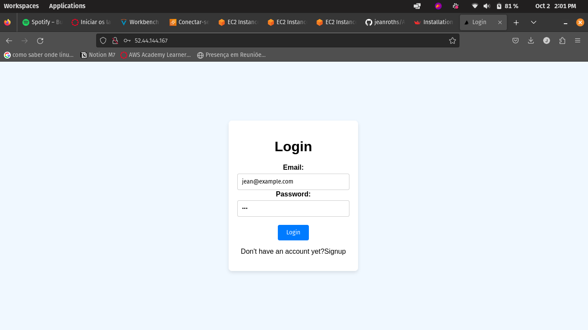
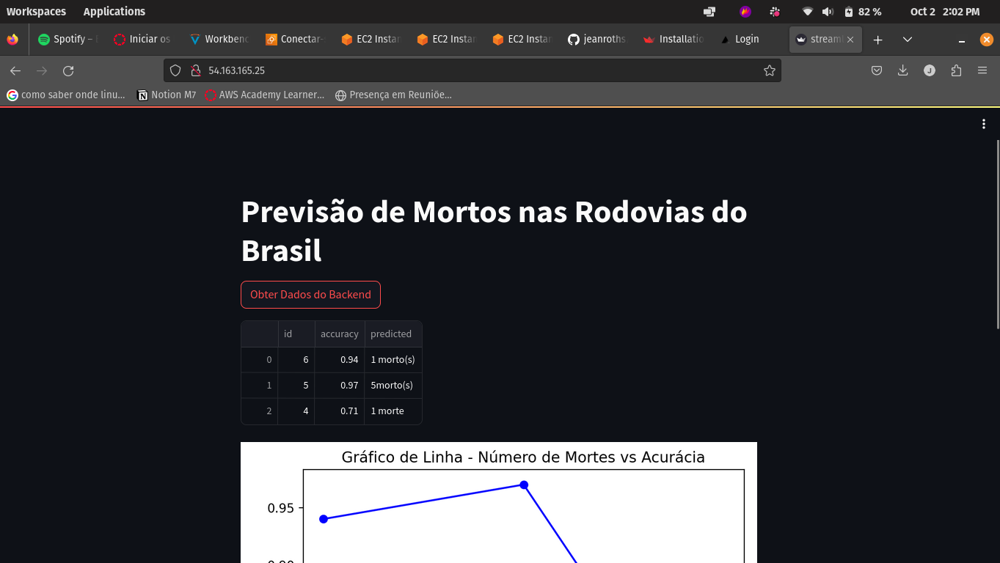
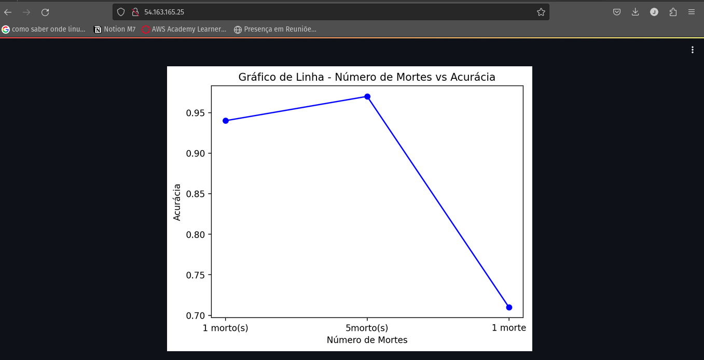
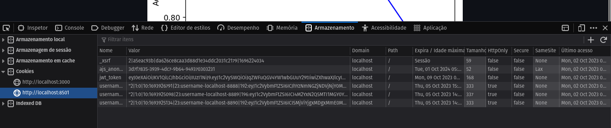
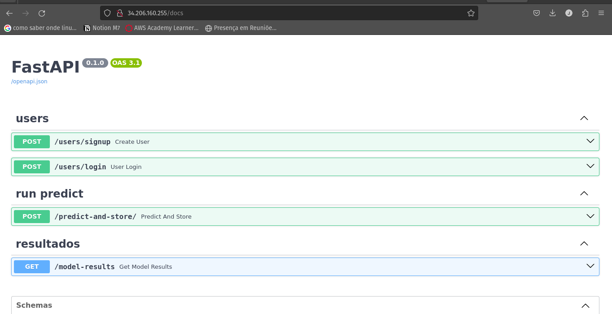
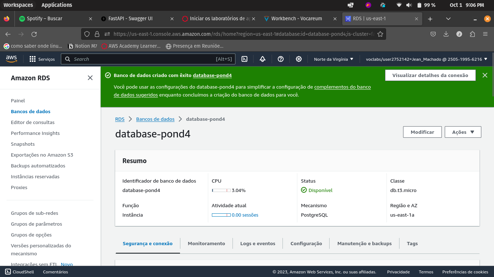
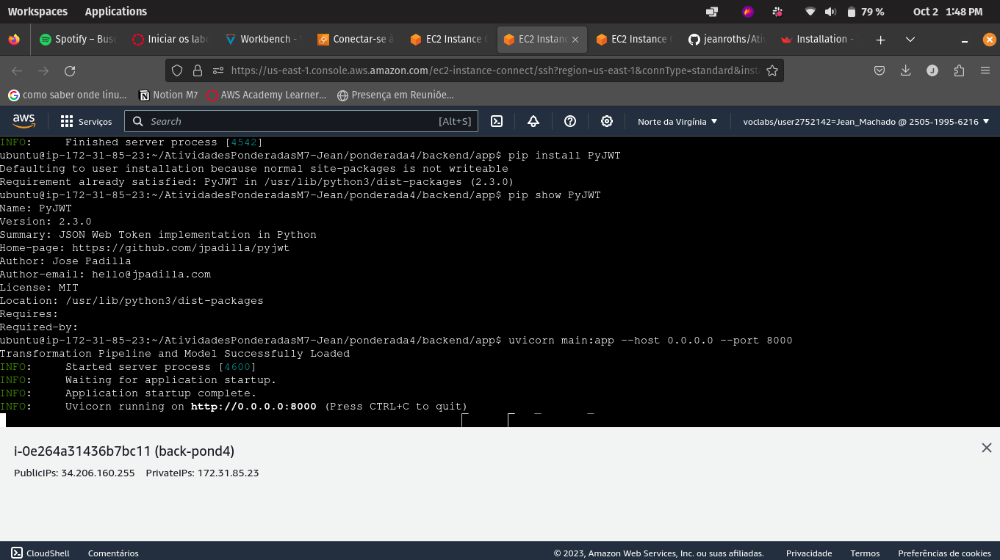
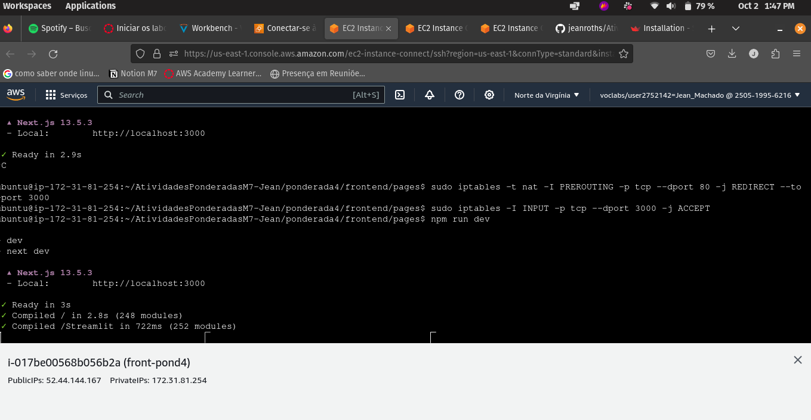
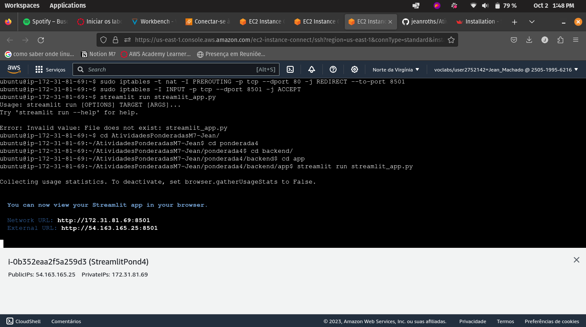

# Atividade 4: Construção de Dashboard para Visualização de Dados

## Enunciado

Esta atividade tem por objetivo realizar a integração das demais atividades desenvolvidas. Ela será o frontend de visualização de dados do modelo disponibilizado. Esta interface deverá consumir os dados disponibilizados da atividade ponderada 3. O acesso a este dashboard deverá acontecer mediante ao login do usuário, conforme desenvolvido na atividade ponderada 2.

> ***IMPORTANTE 1:*** Para está entrega, o estudante deve utilizar o framework de frontend de sua preferência. O framework deve ser justificado pelo estudante. Uma sugestão deframework para a criação do Dashboard é o Streamlit. A interface de login do usuário pode ser implementada com o próprio framework de frontend em conjunto com o FastAPI.

> ***IMPORTANTE 2:*** Para está entrega, gravar a aplicação funcionando na infraestrutura provisionada na AWS para sua execução. Descrever qual infraestrutura foi utilizada e como ela foi provisionada.
## Padrão de qualidade

Os pontos que serão avaliados na entrega do projeto:
1. ***(Até 2.0 ponto)*** Publicação das Imagens para os sistemas: o sistema foi publicada corretamente na cloud (API, Modelo, Backend e Frontend);
2. ***(Até 1.0 ponto)*** Documentação do ambiente de de produção: documentar o ambiente de produção que foi implementado;
3. ***(Até 3.0 ponto)*** Construção do Dashboard: o dashboard foi construído e consome os dados da API;
4. ***(Até 2.0 ponto)*** Construção do Frontend: o frontend foi construído e consome os dados da API e faz o login do usuário;
5. ***(Até 2.0 ponto)*** As instruções no arquivo README foram suficientes para executar a aplicação: as instruções no arquivo README foram suficientes para executar a aplicação APENAS SEGUINDO OS PASSOS CONTIDOS NO DOCUMENTO;

## Instruções:

A entrega do projeto deve ser realizada dentro de um repositório público do Github do estudante. Ao entregar a atividade no sistema da instituição, o estudante deve colocar o link para seu repositório.

O arquivo README do repositório deve conter as informações do estudante, o link para o Dockerhub onde a imagem está hospedada, o que foi desenvolvido (uma breve descrição de até 200 palavras) e o procedimento necessário para executar a aplicação (considerando que o container runtime já está instalado no sistema do usuário).

Deve ser entregue também um video demonstrando o funcionamento do sistema deployado.

## Prazo de Entrega:

O prazo oficial de entrega é até o dia 22/09/2023. Entretanto, entregas serão aceitas até o dia 26/09/2023 (23h59).

# Solução:

Para o desenvolvimento da solução do projeto, desenvolvi 3 partes diferentes, Frontend, Backend e Streamlit, partes das quais desenvolvi localmente e individualmente cada uma, depois integrei e fiz o deploy da solução em instâncias do EC2 na nuvem. 

## Frontend

O Frontend da solução foi desenvolvido em Next.js. Para o desenvolvimento do front, foi criada uma página de Login que possui autenticação com JWT, em que o token gerado ao usuário quando este efetua o login ou cadastro, é salvo no Cookie do site. Para rodar a aplicação, é necessário instalar as dependências da aplicação Next com o comando `npm i` e na pasta `pages` rodar o comando `npm run dev` (pressupondo que as dependências do Node.js já estão instaladas, caso o contrário rode `npm install`).

Após o login do usuário, a página irá chamar uma API que redireciona para outra página que contém a aplicação do Streamlit que carregará um gráfico de linha com os valores armazenados no banco de dados RDS com o resultado de mortes que o modelo preveu por meio da Tag `<iframe>`que leva ao serviço do streamlit.

## Backend

Para o desenvolvimento do backend, foi utilizado o framework FastAPI, em que grande parte das rotas foram reutilizadas da ponderada 2 e 3, em que tem-se as rotas de POST e GET comunicando-se com o banco de dados RDS AWS (PostgeSQL). O Banco de dados possui 2 tabelas sendo uma "Users" e outra "ModelResult", em que uma é responsável por armazenar as informações (email e senha) dos usuário e a outra responsável pelo que foi predito no modelo que foi gerado para predizer a quantidade de mortes em rodovias no Brasil (mortes preditas e acurácia).

Ao fazer o login ou o cadastro, o usuário gera um JWT de acesso responsável pela autorização de outras rotas que ele vai utilizar ao estar autenticado no serviço, ou seja, quando for pegar os resultados do modelo no gráfico da aplicação streamlit. 

Na página de aplicação do serviço streamlit, responsável por gerar o gráfico, o serviço chama uma API "/model-results" que é uma rota GET que pega os 3 últimos valores gerados pelo modelo e coloca no gráfico.

Para executar a aplicação é necessário instalar o framework "FastAPI", as dependências por meio do arquivo "requirements.txt" rodando o comando `pip install -r requirements.txt`, e rodando o servidor por meio do comando `uvicorn main:app --host 0.0.0.0 --port 8000` no diretório em que o arquivo main.py está salvo.

## Streamlit

O streamlit é um framework para criação de aplicações de dashboard e outras tasks interativas em Python de forma mais rápida e dinâmica. Nesse contexto foi utilizado para gerar o gráfico com os resultados do modelo. 

Para executar a aplicação é necessário instalar o framework por meio do comando `pip install streamlit`, navegar até onde a aplicação streamlit.py está e rodar o comando `streamlit run streamlit_app.py`.

## AWS

Após a criação da aplicação local, o projeto foi devidamente colocado no GitHub com um repositório público para que houvesse a possibilidade de levar o repositório com o projeto para as instâncias EC2 da AWS

### EC2 Backend
Aqui as dependências do backend foram instaladas e a instância é responsável por gerir as rotas citadas anteriormente.

### EC2 Fronted
Aqui as dependências do fronted foram instaladas e a instância é reponsável por rodar o serviço em next.js.

### EC2 Streamlit
Aqui, a instância é responsável por subir a aplicação em streamlit que roda a página com o dashboard que é redirecionada quando o login é efetuado.

